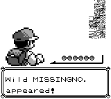
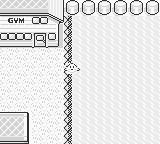

{height=540px}

## Glitches and Learning

- Glitches provide an ideal platform to craft Kolb's learning cycle
- Initial exploration brings confusion as assumptions are violated
- Observation allows learners to construct a more accurate model

## Experimentation

- Learners can test assumptions about their understanding
- This is done through further experimentation in the game world
- This process encourages active exploration and learning

# Case Study

## Classroom Method

- The case study is situated within a larger session on exceptions
- The learning outcome is describing the importance of proper exception handling
- This maintains the intended program state

## Demonstration Setup

- Exploring a glitch requires a mechanism for live demonstration
- Using a classic console is tedious and limits debugging ability
- Emulation is often best for inspection and debugging running games

## Emulation Benefits

- The open source higan emulator was used for this exploration
- Emulation requires creating an image of the game's read-only memory
- Specialized hardware is not required in the classroom during emulation

## Time Control

- Emulation allows the ability to pause, slow down, or rewind time
- Many glitches require time consuming setup or precise execution
- This allows for quick retries or experimentation based on student feedback

## State Restoration

- Emulation systems can create and restore the entire state of a system
- This feature can rapidly jump to a desired point within a game
- This avoids consuming significant class time for setup

## Pokemon Red Glitch

- Pokemon Red is a 90s role-playing game for the Nintendo Game Boy
- Its simple implementation led to well-known, exploitable glitches
- The case explores the well-known "Old man glitch"

---

{height=540px}

## Glitch Mechanism

- The glitch causes the system to access uninitialized memory
- It requires a wild Pokemon battle when wild Pokemon data is not initialized
- This allows the player to encounter and capture invalid "glitch" Pokemon

## Old Man Setup

- The player is taught how to catch Pokemon by a character called "Old Man"
- The game scripts the catching as a cutscene
- The player's name is temporarily replaced by "Old Man" in memory

## Memory Overwrite

- The player's name is stored temporarily in a memory location
- This location happens to be for some wild Pokemon encounter data
- The table shows the encounter data overwritten by the player's name

---

| Address | Purpose | Value |
| :--- | :--- | :--- |
| d887 | Grass Encounter Rate | name[0] |
| d888 | Level 1 | name[1] |
| d889 | Pokemon 1 | name[2] |
| d88a | Level 2 | name[3] |
| d88b | Pokemon 2 | name[4] |
| d88c | Level 3 | name[5] |
| d88d | Pokemon 3 | name[6] |
| d88e | Level 4 | 0x80 |
| d88f | Pokemon 4 | 0x00 |

## Glitch Trigger

- After the cutscene, the player's name is restored
- The wild Pokemon encounter data is left in an invalid state
- This data is not needed in the current region and is usually re-initialized

## Exploitation

- The player must move to a region that does not re-initialize the data
- They must then trigger an appropriate wild Pokemon encounter
- This can be exploited by immediately flying to Cinnabar Island

## Cinnabar Island

- Cinnabar Island was not intended to include wild Pokemon encounters
- It does not re-initialize the wild Pokemon data
- A small strip of water to the east allows encounters, triggering the glitch

---

{height=540px}

## Learning Opportunities

- This example is multifaceted and can be explored in real time
- Several issues work together to allow the final issue
- This shows the importance of defense in depth

## Cybersecurity View

- Minor flaws in different areas combined to produce the observable glitch
- This shows why layered protections and redundant checks are valuable
- The root cause can be mapped to "Use of Uninitialized Resources" (CWE-908)

## Guiding Questions

- What assumptions in the original code are violated by this interaction
- What checks or safer memory practices could have prevented this glitch
- What trade-offs would mitigations incur

## Exception Handling

- In Python, what exceptions would you expect if code used an unexpected value
- How would catching these exceptions prevent crashes or corrupted state
- These questions drive discussion in the intended direction

## Further Exploitation

- Encounters with glitch Pokemon trigger an invalid write
- This is due to their unexpected IDs
- The quantity of the sixth item in a player's inventory is set to 128

## Privilege Gain

- This demonstrates how benign software issues can be exploited
- It can lead to gaining elevated privileges in unexpected ways
- This provides a concrete example of a security vulnerability

# Conclusion

## Assessment

- The case study was in a 50-minute session on exception handling
- Students took a short multiple choice quiz before and after the session
- The quiz tested knowledge of proper exception handling

## Qualitative Feedback

- Qualitatively, students reported being more actively connected to their learning
- One student called it "very engaging"
- Another referred to it as being "much better than usual teaching"

## Conclusion

- The idea of video game glitches as case studies is compelling for many students
- It connects their life experiences with classroom content
- It provides a mechanism for situating knowledge within real software systems

## Future Work

- Additional cases could be crafted and shared for use in other classrooms
- Cases could be evaluated more rigorously and broadly
- Studies could compare this approach against other teaching methods
